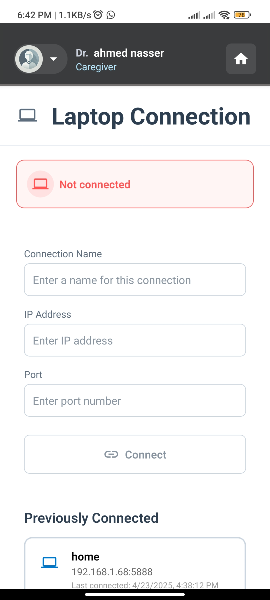

# Healthcarte & Smart Wheelchair Control Application

Cross-platform mobile app for controlling smart wheelchair remotely and tracking patients' health status.

## 📹 Demo

<video controls autoplay width=250 >
  <source src="demo/mobile-app-demo.mp4" type="video/mp4" />
</video>

## 📱 Screenshots





## ✨ Features

- Create accounts with patient or caregiver roles
- Relate caregivers to patients
- Connect to patient's laptop via WebSocket
- Change wheelchair's control mode
- Control wheelchair remotely
- View patient's vital stats in real-time or history
- Notify caregivers in case of emergency

## 🔧 Tech Stack

- React Native
- Expo SDK 50+

## 🚀 Getting Started

### Prerequisites

- Node.js & npm
- (optional) Android Studio or Xcode

### Run the App

```bash
git clone https://github.com/ahmed0nasser/gp-mobile-app.git
cd gp-mobile-app
npm install
npm start
```

Use Expo Go on your phone or if you have Android Studio or Xcode, you can run on emulator/simulator.

## 📒 Important Notes

- App can connect to laptop running [gp-laptop-program](https://github.com/ahmed0nasser/gp-laptop-program)
- App's Backend: [gp-backend](https://github.com/ahmed0nasser/gp-backend)

## 🙏 Acknowledgements

- [ReactNative Docs](https://reactnative.dev/docs/getting-started)
- [Expo Docs](https://docs.expo.dev/)
- [SVGREPO](https://www.svgrepo.com/): Open-licensed SVG Vector and Icons
- [SVGR](https://react-svgr.com/playground/?native=true&typescript=true): For converting .svg files to react-native components
